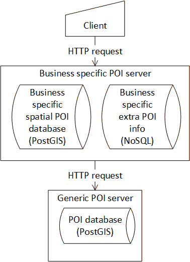
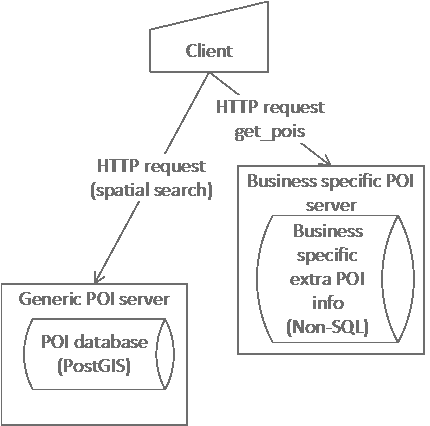
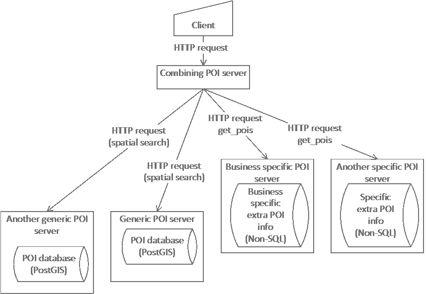

# POI Data Provider - User and Programmers Guide
## Introduction 
This document describes how to design and implement a distributed system utilizing the [POI Data Provider Open Specification](http://forge.fiware.org/plugins/mediawiki/wiki/fiware/index.php/FIWARE.OpenSpecification.MiWi.POIDataProvider).

The available architecture gives wide possibilities to develop systems utilizing location data. Publicly available generic data can be augmented by business or application specific data. The system can utilize private data with restricted access.

Considerations in distributed system architecture are covered in [System design considerations](#System_design_considerations).

Server design principles are covered in [Server programming guide](#Server_programming_guide).

Client design and implementation is covered in [Client programming guide](#Client_programming_guide).

#### Background and Detail 
This User and Programmers Guide relates to the POI Data Provider GE which is part of the [Advanced Middleware and Web User Interfaces chapter](http://forge.fiware.org/plugins/mediawiki/wiki/fiware/index.php/Advanced_Middleware_and_Web_UI_Architecture). Please find more information about this Generic Enabler in the related [Open Specification](http://forge.fiware.org/plugins/mediawiki/wiki/fiware/index.php/FIWARE.OpenSpecification.MiWi.POIDataProvider) and [Architecture Description](http://forge.fiware.org/plugins/mediawiki/wiki/fiware/index.php/FIWARE.ArchitectureDescription.MiWi.POIDataProvider).

## User guide 

This section does not apply as this GE implementation is for programmers, who will invoke the APIs programmatically, there is no user interface as such.

## Programmers guide 

### System design considerations 

System architecture based on POI servers is quite free. It is possible to use publicly available and proprietary POI data providers together. 

#### Using distributed data 

A POI related application may have needs exceeding the capabilities of available public POI data providers, e.g.:

* More data must be associated to POIs
* More POIs are needed
* Private extensions to POIs and data are needed
* High-integrity data are needed

These needs can be addressed using several POI databases together. Private POI servers with possible access control can extend the scope of this technology to **demanding critical solutions**.

It is easy to **combine data in several POI servers** for use. 

* A client program can query several POI servers. 
* A POI server can query other POI servers.

A query may request

* more POIs and
* more data on given POIs.

Because POIs are identified by UUIDs it is possible to combine data about a POI from several otherwise unrelated POI data providers. 

*The  UUID of a POI must be the same in different databases, or explicit mapping is needed.*

#### Using separate data 

Of course, public POI data providers are not required, if they are not useful for the application. The application can use POI data provider(s) and POIs totally separated from the publicly available ones.

#### Using SQL and NoSQL databases 

SQL databases, including PostGIS, are good in searches with several limiting conditions. However, they are laborious to program for given data content. NoSQL databases are easy to use for arbitrary data, but they are worse in general searches. This POI architecture uses PostGIS database for searches based on spatial and other conditions. NoSQL database is used to store other information about POIs. PostGIS database provides the UUID of the POI. The UUID is used as a key to access a NoSQL database for the rest of the data.

#### Architecture examples 

Following are some configurations combining several POI data providers.

 
Business specific POI server uses another POI server

 
Client uses several POI servers

 
General case: A POI server combines data from several POI data providers

### Interface reference 

Interfacing between client and server is defined in [POI Data Provider Open API Specification](http://forge.fiware.org/plugins/mediawiki/wiki/fiware/index.php/POI_Data_Provider_Open_API_Specification).

### Server programming guide 

#### Implementing a special-purpose POI Data Provider 

You can use the provided POI Data Provider implementation as a basis for writing your own specific implementation. The part of the code you most likely have to modify the most are the database queries, as you may have specified your own database model. The following links contain guides for using both PostGIS and MongoDB:

[Introduction to PostGIS](http://workshops.boundlessgeo.com/postgis-intro/)

[The MongoDB 2.4 Manual](http://docs.mongodb.org/manual/)

#### Composing a POI Data Provider from multiple backends 

You can write a POI Data Provider backend that composes data from multiple different POI Data Provider backends. The high-level application logic for such a implementation is presented here:

**Handling spatial queries (e.g. radial\_search)**

1. Forward the spatial query to a POI backend that is capable of handling them (core backend)
1. Parse the response to the spatial query and create a list of POI UUIDs
1. Loop through the rest of the POI backends and request additional data components for each UUID with get\_pois request
1. Construct the final output JSON by appending the additional data components for each POI

**Handling get\_pois queries**

The get\_pois query is a simpler case than the spatial queries, as you directly get the list of UUIDs as the request parameter:
1. Loop through the POI backends and request additional data components for each UUID with get\_pois request
1. Construct the final output JSON by appending the additional data components for each POI

### Client programming guide 

See [Interface reference](#Interface_reference) for

* **details of communication** with POI servers and 
* essential **data structures** provided by POI servers.

#### General on client design 

General pattern of client operation is

1. sorting out the area and other attributes of current interest - possible user interaction,
1. **generic query** for POIs using spatial and other conditions,
1. selecting the POI(s) to be focused on - possible user interaction,
1. **specific query** for more data on specific POIs,
1. using (showing) the acquired POI data - possible user interaction.

This manual describes how to program the queries to POI servers. Language used in examples is JavaScript due its wide availability in web browsers.

The common parts used in queries are described in separate section.

[XMLHttpRequest](http://www.w3.org/TR/XMLHttpRequest/)  is used to perform REST queries.

#### Spatial query 

Spatial query is used to find the POIs based on their location. See [[#Interface reference|Interface reference]] for complete treatment of available query choices. 

JavaScript skeleton for requesting POIs in given radius below gives an example how to implement a query in a client.

    /*
      Query parameters:
      
      BACKEND_ADDRESS_POI - example: "http://poi_dp.example.org/poi_dp/"
      lat - latitude of the center point, degrees north
      lng - longitude of the center point, degrees east
      searchRadius - meters
      languages - a string array containing the accepted language codes
    */
    var query_url = BACKEND_ADDRESS_POI + "radial_search?" +
     "lat=" + lat + "&lon=" + lng + "&radius=" + searchRadius + "&component=fw_core";
   
    poi_xhr = new XMLHttpRequest();
    poi_xhr.onreadystatechange = function () {
      if(poi_xhr.readyState === 4) {
        if(poi_xhr.status  === 200) { 
          var resp_data = JSON.parse(poi_xhr.responseText);
          process_response(resp_data);
        }
        else { 
          console.log("failed: " + poi_xhr.responseText);
        }
      }
    }
   
    poi_xhr.onerror = function (e) {
      log("failed to get POIs");
    };
   
    poi_xhr.open("GET", query_url, true);
    set_accept_languages(poi_xhr, languages);
    poi_xhr.send();

#### Additional data query 

Additional data for POIs already found can be requested using UUIDs of POIs as keys. Below is a JavaScript skeleton for requesting more data on given POIs. 

    /*
      Query parameters:
      
      BACKEND_ADDRESS_X_POI - example: "http://poi_dp.example.org/poi_dp/"
      uuids[] - string array containing UUIDs of interesting POIs
      languages - a string array containing the accepted language codes
    */
    var query_url = BACKEND_ADDRESS_X_POI + "get_pois?poi_id=" + join_strings(uuids, ",");
   
    poi_xhr = new XMLHttpRequest();
    poi_xhr.onreadystatechange = function () {
      if(poi_xhr.readyState === 4) {
        if(poi_xhr.status  === 200) { 
          var resp_data = JSON.parse(poi_xhr.responseText);
          process_response(resp_data);
        }
        else { 
          console.log("failed: " + poi_xhr.responseText);
        }
      }
    }
   
    poi_xhr.onerror = function (e) {
      log("failed to get POIs");
    };
   
    poi_xhr.open("GET", query_url, true);
    set_accept_languages(poi_xhr, languages);
    poi_xhr.send();

#### Handling received POI data 

Query response consists of <code>pois</code> data on requested POIs, which consists of POI items having POI UUIDs as their keys.

Example data (shortened and annotated):

    {
      "pois": {
        "6be4752b-fe6f-4c3a-98c1-13e5ccf01721": {
          "fw_core": {
            "category": "cafe",
            "location": {&lt;location of Aulakahvila&gt;}, 
            "name": {
              "": "Aulakahvila"
            },
            &lt;more core data on Aulakahvila&gt;
          },
          &lt;more data components on Aulakahvila&gt;
        }, 
        "ae01d34a-d0c1-4134-9107-71814b4805af": {&lt;data on restaurant Julinia&gt;},
        "1c022820-62dc-487b-95b4-6c344d6ba85e": {&lt;data on library Tiedekirjasto Pegasus&gt;},
        &lt;more data on more POIs&gt;
      }
    }

First, the received text is parsed using <code>[**JSON.parse()**](https://developer.mozilla.org/en-US/docs/Web/JavaScript/Reference/Global_Objects/JSON/parse) </code> function. 

**NOTE: For security reasons do not use <code>eval()</code>** function to parse the data! Maliciously formatted data can be used to compromise the security.

Then, the resulting data structure is processed for POI data. The function skeleton <code>process\_response</code> below is an example how to process the data.

For the detailed structure of the response data see [Interface reference](#Interface_reference|).

##### <code>process\_response( data )</code> - skeleton 
 
    function process_response( data ) {
 
        var counter = 0, jsonData, poiData, pos, i, uuid, pois,
            contents, locations, location, searchPoint, poiCore,
            poiXxx;
 
        if (!(data && data.pois)) {
            return;
        }
 
        pois = data['pois'];
 
        /* process pois */
 
        for ( uuid in pois ) {
            poiData = pois[uuid];
            /*
               process the components of the POI
               e.g. fw_core component containing category, name,
               location etc.
               Taking local copies of the data can speed up later 
               processing.
            */
            poiCore = poiData.fw_core;
            if (poiCore) {
              /* fw_core data is used here */
 
            }
            /* Possible other components */
            poiXxx = poiData.xxx;
            if (poiXxx) {
               /* xxx data is used here */
 
            }
        }
    }

#### Adding a new POI 

Below is a JavaScript skeleton for adding a new POI to the POI-DP.

    BACKEND_ADDRESS_POI = "http://poi_dp.example.org/poi_dp/";
 
    poi_data = {fw_core: {...},  -other components- };
 
    function addPOI( poi_data ) {
        var restQueryURL;
 
        restQueryURL = BACKEND_ADDRESS_POI + "add_poi";
        miwi_poi_xhr = new XMLHttpRequest();
 
        miwi_poi_xhr.overrideMimeType("application/json");
 
        miwi_poi_xhr.onreadystatechange = function () {
            if(miwi_poi_xhr.readyState === 4) {
                if(miwi_poi_xhr.status  === 200) {
                  // React to successfull creation
                  //  alert( "success: " + miwi_poi_xhr.responseText);
                }
                else {
                  // React to failure
                  // alert("failed: " + miwi_poi_xhr.readyState + " " + miwi_poi_xhr.responseText);
                }
            }
        }
        miwi_poi_xhr.onerror = function (e) {
            // React to error
            // alert("error" + JSON.stringify(e));
        };
        miwi_poi_xhr.open("POST", restQueryURL, true);
        miwi_poi_xhr.send(JSON.stringify(poi_data));
    }

#### Updating POI 

Below is a JavaScript skeleton for updating POI data in the POI-DP.

First, the data is fetched from the server.

    BACKEND_ADDRESS_POI = "http://poi_dp.example.org/poi_dp/";
 
    var query_handle;
 
    function POI_edit(uuid) {
    /*
        uuid - the id of the POI to be updated
    */
        var restQueryURL, poi_data, poi_core;
        // get_for_update brings all language variants etc.
        restQueryURL = BACKEND_ADDRESS_POI + "get_pois?poi_id=" + uuid +
            "&get_for_update=true";
        
        console.log("3D restQueryURL: " + restQueryURL);
        query_handle = new XMLHttpRequest();
        
        query_handle.onreadystatechange = function () {
            if(query_handle.readyState === 4) {
                if(query_handle.status  === 200) { 
                    //console.log( "succes: " + xhr.responseText);
                    var json = JSON.parse(miwi_3d_xhr.responseText);
                    var poi_edit_buffer = json.pois[uuid];
                    
                    /* Here a data editor is opened to edit the contents of poi_edit_buffer.
                       updatePOI is a callback that is called to send update to server.
                       uuid is passed to the callback. Other parameters are for information, only.
                    */
                    A_nonspecific_data_editor("update poi "  + uuid, "Edit POI data", poi_edit_buffer, uuid, updatePOI);
                    
                }
            }
        }
        query_handle.onerror = function (e) {
            log("failed to get data");
        };
 
        query_handle.open("GET", restQueryURL, true);
        query_handle.send();
   }

When editing is ready, the new version of data is sent to the server.

    function updatePOI( poi_data, uuid ) {
    /*
      poi_data is the updated version of POI data like:
        {
          "fw_core": {...},
          "fw_times": {...}
        }
      uuid is the id of the POI
    */
        var restQueryURL;
        var updating_data = {};
    /* build updating structure like
        { 
          "30ddf703-59f5-4448-8918-0f625a7e1122": {
            "fw_core": {...},
            ...
          }
        }
    */
      updating_data[uuid] = poi_data;
      
      restQueryURL = BACKEND_ADDRESS_POI + "update_poi";
      query_handle = new XMLHttpRequest();
      
      query_handle.overrideMimeType("application/json");
      
      query_handle.onreadystatechange = function () {
          if(query_handle.readyState === 4) {
              if(query_handle.status  === 200) { 
                // Here we may notify the user of successfull update
                // alert( "success: " +query_handle.responseText);
              }
          }
      }
      query_handle.onerror = function (e) {
          // Something bad happened
          alert("error" + JSON.stringify(e));
      };
      // define the operation and URL
      query_handle.open("POST", restQueryURL, true);
      // send the data
      query_handle.send(JSON.stringify(updating_data));
    }

#### Deleting POI 

Below is a JavaScript skeleton for deleting a POI from the POI-DP.

    BACKEND_ADDRESS_POI = "http://poi_dp.example.org/poi_dp/"; // for example
 
    function POI_delete(uuid) {
      var restQueryURL, poi_data, poi_core;
      
      var cfm = confirm("Confirm to delete POI " + uuid);
      if (cfm)
      {
        // build the URL for delete
        restQueryURL = BACKEND_ADDRESS_POI + "delete_poi?poi_id=" + uuid;
        
        miwi_3d_xhr = new XMLHttpRequest();
        // populate the request with event handlers
        miwi_3d_xhr.onreadystatechange = function () {
            if(miwi_3d_xhr.readyState === 4) {
                if(miwi_3d_xhr.status  === 200) { 
                    // Notify user about success (if wanted)
                    alert("Success: " + miwi_3d_xhr.responseText);
                }
            }
        }
 
        miwi_3d_xhr.onerror = function (e) {
            log("failed to delete POI " + JSON.stringify(e));
        };
 
        // Note: It seems to help DELETE if the client page is in the
        //       same server as the backend
        miwi_3d_xhr.open("DELETE", restQueryURL, true);
        miwi_3d_xhr.send();
      }
   }

#### Utility functions 

##### <code>join\_strings(strings\_in, separator)</code> 

This function can be used to make a comma separated string from an array of strings.

    function join_strings(strings_in, separator) { //: string
      /*
        strings_in string array
        separator string to be inserted between strings_in
   
        *result string - strings of strings_in separated by separator
      
        Example: join_strings(["ab", "cd", "ef"], ",") -> "ab,cd,ef"
      */
      var result, i;
    
      result = strings_in[0] || "";
      for (i = 1; i < strings_in.length; i++) {
        result = result + separator + strings_in[i];
      }
    
      return result;
    }

##### <code>set\_accept\_languages(http\_request, languages)</code> 

This function is used to define preferred languages for query responses. The language preferences are coded to the <code>Accept-Languages</code> header of the http request.

    set_accept_languages(http_request, languages) {
      /*
        This function creates an Accept-Languages header to the HTTP request.
        This must be called between http_request.open() and 
        http_request.send() .
   
        http_request - an instance of XMLHttpRequest
        languages    - string array containing the codes of the languages 
                       accepted in the response in descending priority. 
                       The ISO 639-1 language codes are used. If any language 
                       texts are accepted in case of none of the listed 
                       languages are found, an asterisk is used as the last 
                       code.
                       Example: ["en","fi","de","es","*"]
      */
      var i, q;
      
      q = 9;
      for (i = 0; i < languages.length; i++) {
        if (i == 0) {
          http_request.setRequestHeader('Accept-Language', languages[0]);
        } else {
          if (languages[i] != "") {
            http_request.setRequestHeader('Accept-Language', languages[i] +
                ';q=0.' + q);
            if (q > 1) {
              q--;
            }
          }
        }
      }
    }
